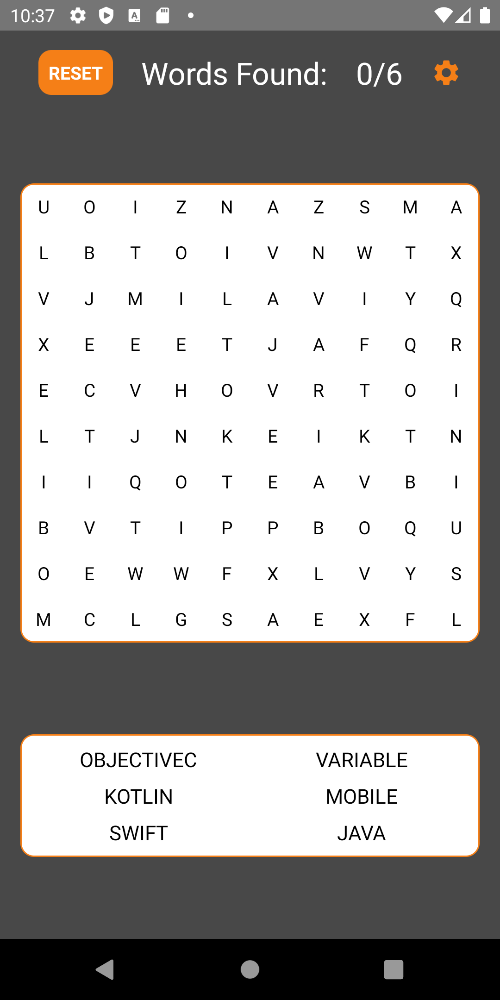
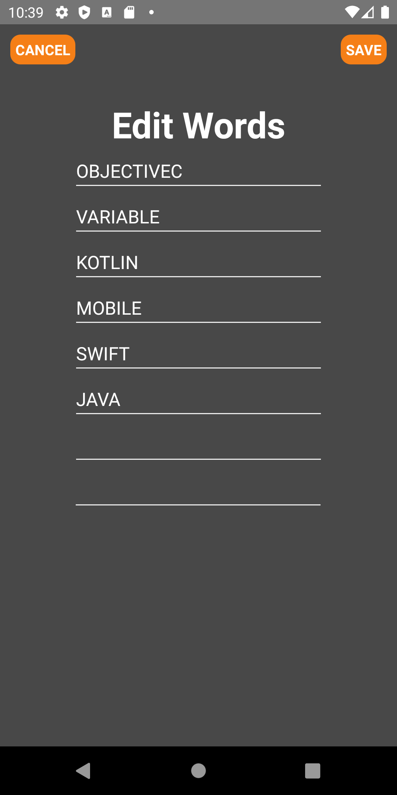

# WordSearch_19
A word search application that was done for Shopify's Android Dev. Internship.

May 2019
- Complete application in Java with a broken MVC design pattern.

Nov. 2019
- Refactored and reworked application to be written completely in Kotlin and to include the updated MVVM architecture
- Reworked logic for highlighting and finding words

Jan. 2020
- Refactored the MVVM architecture to include Android's ViewModel library
- Refactored Activity views to include Fragments
- Improved code architecture
- Implemented Dagger2 to simplify code base
- Cleaned up the UI to implement dark interface, and changed order of layout
- Added animations to buttons

Unsolved

Found Words

Settings

